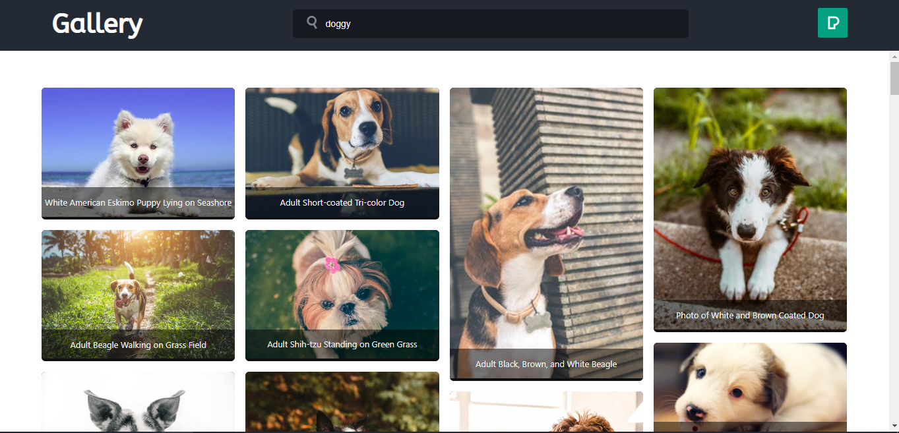

# Gallery Pexels

## Category:

- Gallery
- Use of API
- React project

## Overview

I wanna make some application where it uses an API service, so I do this. The API that I'm using come from [Pexels](https://www.pexels.com) (A media service).

## Screenshot



## Local deployment

This app makes use of **Vite**, so local deployment is as simple as run the following:

```
npm run build
```

then

```
npm run preview
```

## Demo

- Uploaded on Netlify: https://goota-gallery-pexels.netlify.app
